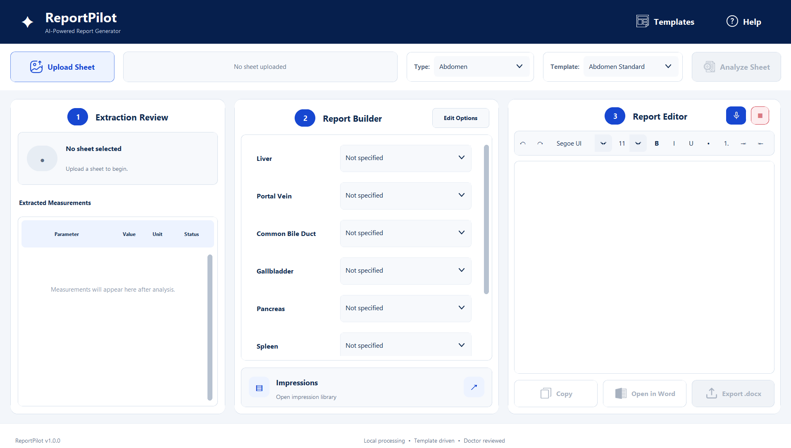
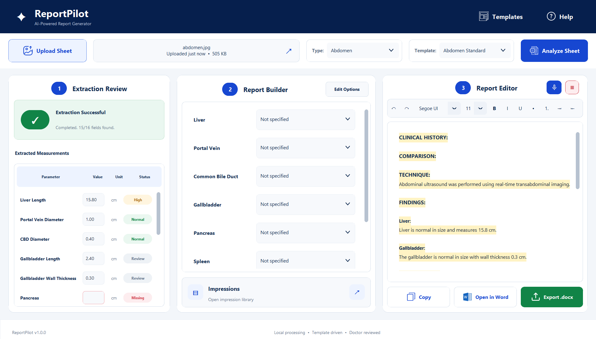

# Screenshots

All screenshots in this directory use synthetic test data.

## Initial Workspace

The application opens into a three-stage workflow:

1. Extraction Review
2. Report Builder
3. Report Editor

## Analysis Complete

After a worksheet is analyzed, the interface displays:

- extraction completion status
- detected measurements
- interpretation states such as normal, high, review, and missing
- structured report content
- copy, Word, and DOCX export actions

